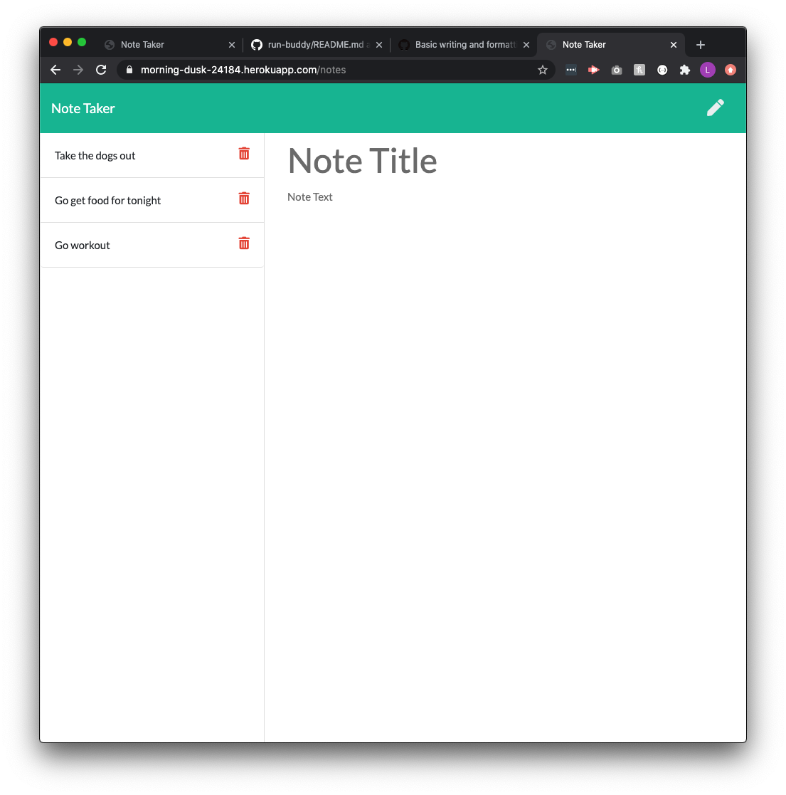

<h1 align="center">Welcome to Note Taker 👋</h1>

  
  

> This project showcases how Express.js can allow for multiple cards and be added and taken away from a site using a server. Through GET and POST requests, the site can hold all the note cards one creates as long as the server is still on.

## Website

https://morning-dusk-24184.herokuapp.com/

## Screenshot

## Author

👤 **Leo Ayala**

* Github: [@leo-ayala](https://github.com/leo-ayala)

